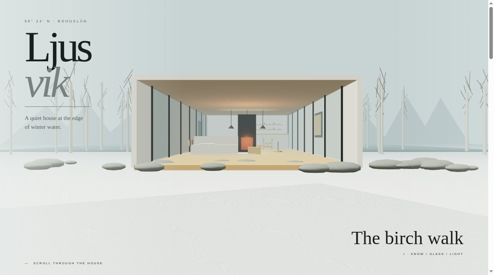

# Ljusvik

A house by the water. A cinematic scroll-through tour of a Nordic longhouse.



**Live:** https://aeiouvcode.github.io/ljusvik/

## About

A quiet glass-and-timber house at the edge of winter water, 58° 24′ N in Bohuslän, Sweden. Scroll to move through it: the birch walk, snow, glass and light. The house and its surroundings are generated in real time.

A sister piece, [Vargmyra](https://github.com/aeiouvcode/vargmyra), is set in Norrland.

## Built with

Three.js and WebGL, bundled into a single self-contained `index.html`. Ambient sound is generated with Web Audio.

## Run locally

```sh
git clone https://github.com/aeiouvcode/ljusvik.git
cd ljusvik
python3 -m http.server 8000
```

Then open http://localhost:8000.
